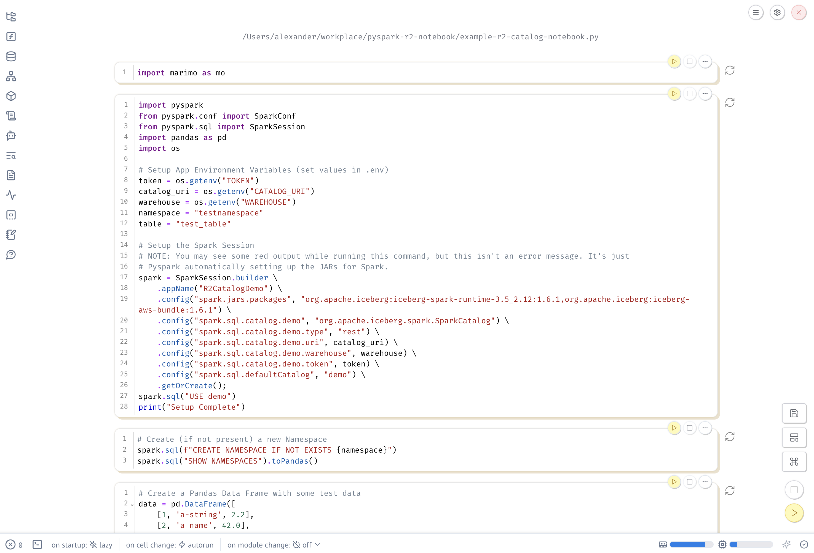

# R2 Data Catalog PySpark Notebook Demo

In this example, we'll get you set up with a PySpark Notebook using [Marimo](https://marimo.io/) (it's like a Jupyter notebook, but sexier).

For an interactive demo using this setup (and to learn more about R2 Data Catalog), check out our [Dev Week 2025 Day 4 recording](https://cloudflare.tv/shows/developer-week/developer-week-day-4-delivering-data-at-global-scale/jvPzRkZz) on Cloudflare TV.



To get started, we recommend you use a Python [virtual environment](https://docs.python.org/3/library/venv.html) (venv), so that you isolate the packages installed to that environment. It won't globally install in your machine.

We also have an example Marimo notebook which is already set up with some sample queries at `example-r2-catalog-notebook.py`. You can checkout this repository and start up the notebook with Marimo.

But we also describe each step in case you want to follow along by yourself.

## Get Stared with R2 Data Catalog

You'll need two things from Cloudflare to run this demo:

1. A R2 Bucket with a Data Catalog Enabled
2. A Cloudflare API Token with R2 Catalog permissions

Follow steps 1-3 in the ["Getting Started" Guide](https://developers.cloudflare.com/r2/data-catalog/get-started/). Be sure to save the bearer token, warehouse name, and catalog URI since you'll need those to get connected from the notebook.

_NOTE: Our getting started guide suggests using "uv" as a Python dependency manager. However, in this demo, we will only use `pip` and `venv`._

## Setup PySpark with Marimo

The following steps will walk you through installing dependencies, and starting up a Marimo notebook.

**Step 1: Setup your virtual enviornment**

```shell
python3 -m venv r2-data-catalog-env
source r2-data-catalog-env/bin/activate
```

**Step 2: Install Marimo Notebook**

```shell
pip install marimo
```

**Step 3: Install dependencies**

These are the dependencies you'll use in the Notebook.

```shell
pip install pyspark==3.5.1
pip install pandas
pip install jupyter
pip install setuptools
```

**Step 4: Add your Token to an .env file**

You could add the token directly to the Notebook if you'd like. But it's a good practice to keep these variables (especially the cloudflare API token!) in this `.env` to reduce the liklihood of accidentially sharing or revealing secrets.

Copy and paste the following block into your shell to create an `.env` file.

```shell
cat > .env <<EOL
TOKEN=<my_token>
WAREHOUSE=<my_warehouse>
CATALOG_URI=<my_catalog_uri>
EOL
```

You also need to setup a pyspark.toml to let Marimo know about the .env file.

```shell
cat > pyproject.toml <<EOL
[tool.marimo.runtime]
dotenv = [".env"]
EOL
```

**Step 5: Run Marimo**

```shell
marimo edit my-r2-data-catalog.py
```

## Connect your Notebook to R2 Data Catalog


The following is an example set of configuration you can use to get connected to your R2 Data Catalog via the notebook. These code samples walk through setting up the Notebook, but if you want to jump in, just open the notebook bundled with this repo.

```shell
marimo edit example-r2-catalog-notebook.py
```

Other wise, if you want to start from an empty Notebook, you can name it anything you want.

```shell
marimo edit my-awesome-r2-catalog-notebook.py
```

**Step 1: Setup PySpark/Iceberg Config**

```python
import pyspark
from pyspark.conf import SparkConf
from pyspark.sql import SparkSession
import pandas as pd
import os

# Setup App Environment Variables (set values in .env)
token = os.getenv("TOKEN")
catalog_uri = os.getenv("CATALOG_URI")
warehouse = os.getenv("WAREHOUSE")
namespace = "testnamespace"
table = "test_table"

# Setup the Spark Session
# NOTE: You may see some red output while running this command, but this isn't an error message. It's just
# Pyspark automatically setting up the JARs for Spark.
spark = SparkSession.builder \
    .appName("R2CatalogDemo") \
    .config("spark.jars.packages", "org.apache.iceberg:iceberg-spark-runtime-3.5_2.12:1.6.1,org.apache.iceberg:iceberg-aws-bundle:1.6.1") \
    .config("spark.sql.catalog.demo", "org.apache.iceberg.spark.SparkCatalog") \
    .config("spark.sql.catalog.demo.type", "rest") \
    .config("spark.sql.catalog.demo.uri", catalog_uri) \
    .config("spark.sql.catalog.demo.warehouse", warehouse) \
    .config("spark.sql.catalog.demo.token", token) \
    .config("spark.sql.defaultCatalog", "demo") \
    .getOrCreate();
spark.sql("USE demo")
print("Setup Complete")
```

**Step 2: Create a Namespace**

```python
spark.sql(f"CREATE NAMESPACE IF NOT EXISTS {namespace}")
spark.sql("SHOW NAMESPACES").toPandas()
```

**Step 3: Write some data to your test table**

```python
# Create a Pandas Data Frame with some test data
data = pd.DataFrame([
    [1, 'a-string', 2.2],
    [2, 'a name', 42.0],
    [3, 'foo bar', -101.101],
    [4, 'fizz buzz', 0.2],
    [5, 'hello world', -10.0]
], columns=['id', 'name', 'num'])

# Convert to a Spark Data Frame
sparkDataFrame = spark.createDataFrame(data)

# Write to Iceberg (WARN: this replaces the table if it already exists)
sparkDataFrame.writeTo(f"{namespace}.{table}").createOrReplace();
print("Done!")
```


**Step 4: Query your data**

Query all data.

```python
spark.sql(f"SELECT * FROM {namespace}.{table}").toPandas()
```

Only query rows with negative values.

```python
spark.sql(f"SELECT id,name FROM {namespace}.{table} WHERE num < 0.0").toPandas()
```

**Step 5: Have fun!**

Now you have a Notebook that is connected to your R2 Data Catalog, go forth and do big data things.

If you'd like to load a larger data set for more complex queries, try out the [New York City Taxi Dataset](https://www.nyc.gov/site/tlc/about/tlc-trip-record-data.page).

You can load Parquet files and write them to Iceberg in just a few lines of code:
```python
# Load the NYC Yellow Cab Taxi data for Jan 2025
nyc_taxi_data = spark.read.parquet("yellow_tripdata_2025-01.parquet")
nyc_taxi_data.writeTo("mynamespace.taxi_data").create()
```